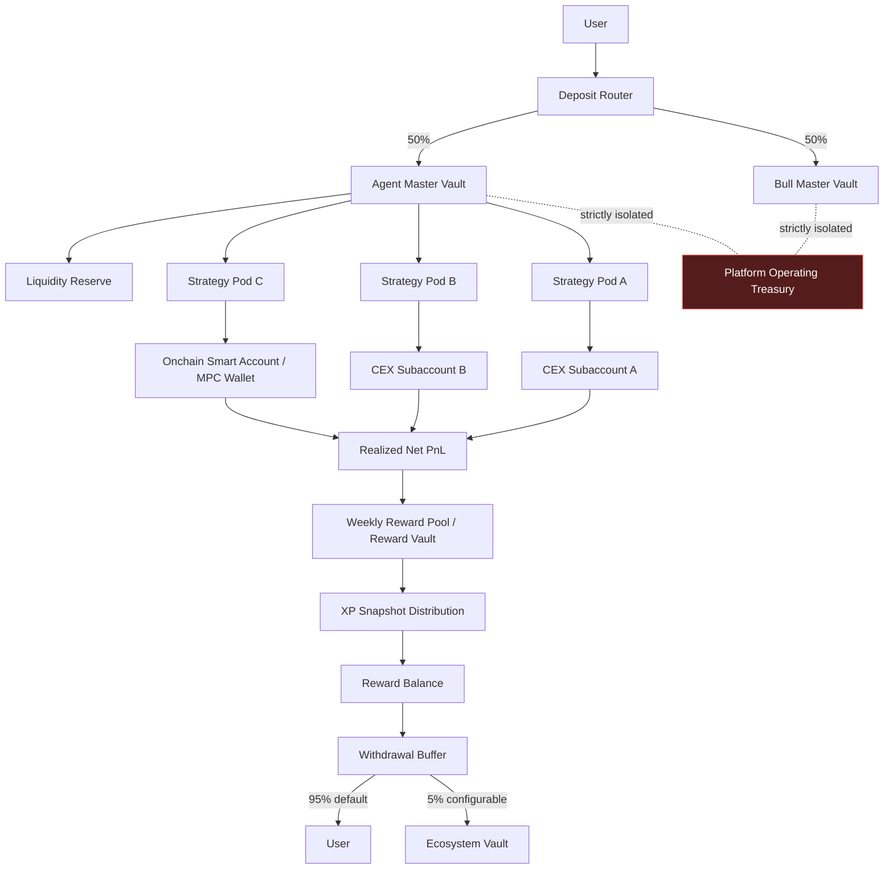
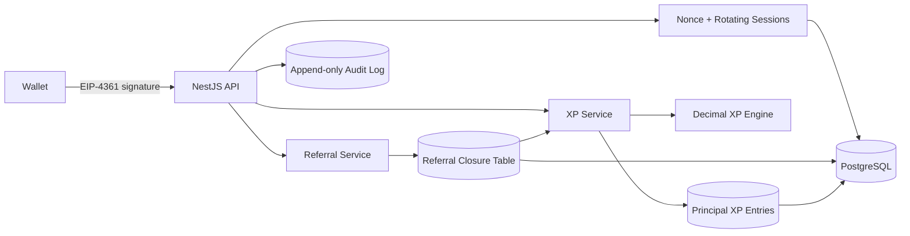

# XGOU Architecture

## Target fund flow

Platform Operating Treasury 与 User Bull Assets、User Agent Assets、Strategy Pods、Reward Vault、Withdrawal Buffer 和 Ecosystem Vault 在法律实体、账户、账本与权限上均须隔离。上图是目标架构；Phase 1 只实现下面的 identity/referral/XP control plane。

## Phase 1 runtime

### Boundaries

- Controllers validate transport input and authenticate callers; domain rules stay in engine/service packages.
- PostgreSQL is the source of truth. Redis is reserved for queues, locks, rate limit and cache—not balances.
- Referral writes are serializable. The closure table stores self rows at depth 0 and ancestors at positive depth.
- XP queries aggregate immutable Principal XP entries. Dynamic XP is calculated once from qualifying depths and is never recursively reused.
- Versioned `SystemConfigVersion` rows make every threshold and rate reproducible for future epoch snapshots.

## Planned module boundary

Future phases add `ledger`, `contracts`, `risk-engine`, `strategy-engine`, `exchange-adapters`, `wallet-adapters`, `agent-core`, `worker`, `web` and `admin` as separate packages/apps. External exchanges, chains, wallets and AI providers enter only through interfaces; sandbox adapters remain the default until an explicit production readiness gate is satisfied.
