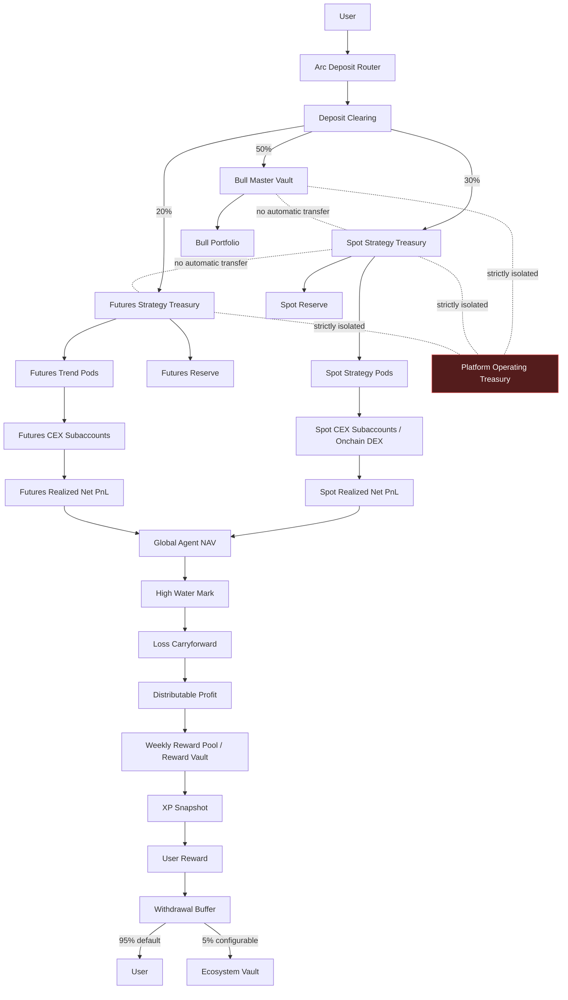
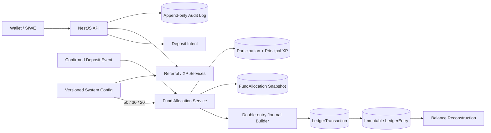

# XGOU Architecture

## Target fund and reward flow



Platform Treasury 与 Bull、Spot、Futures、Reward、Withdrawal Buffer、Ecosystem 资金域完全隔离。交易 Agent 只能提交 proposal；Treasury allocation、withdrawal 和跨域 rebalance 不属于 Agent 权限。

## Current Phase 2A runtime



### Boundaries

- PostgreSQL LedgerEntry 是余额事实来源；Redis 不保存最终余额。
- 一笔确认入金生成 `DEPOSIT_CONFIRMATION` 和 `FUND_ALLOCATION` 两个平衡 Journal。
- Bull、Spot、Futures 账户类型与 `fundDomain` 在领域层和数据库约束层同时校验。
- 用户只能创建 Deposit intent，不能自行把状态改为 confirmed 或触发伪造链上入账。
- 所有分配保存生效的 System Config version，以便审计、重放与争议处理。
- XP 规则保持 Phase 1 原样；有效入金完成分配后才生成 Participation 与 Principal XP。

## Planned boundaries

Phase 2B 增加 Arc Chain Registry、finality adapter 和 Vault contracts。Phase 3 增加隔离的 Spot/Futures Paper accounts、risk engine 和 execution adapters。Phase 4 增加 NAV、High Water Mark、Loss Carryforward、Reward Pool 和提现费。未完成模块不会用占位接口伪装成可用功能。
# Phase 3B futures paper pipeline

```text
FuturesVault (read-only reference)
  -> Ledger Futures Capital (read-only mirror)
  -> Paper Futures Strategy Account
  -> Public / Fixture Market Data
  -> FUTURES_TREND_V1 Signal
  -> Futures Risk Engine
  -> Paper Perp Execution
  -> Margin / One-way Position
  -> MTM / Funding
  -> Futures NAV / Circuit

NO REAL FUNDS MOVE
```

Spot and Futures use separate accounts, positions, baselines, circuit state, cycle IDs, and Redis locks. Paper performance is illustrative and is excluded from real Ledger balances, Dashboard total assets, and Rewards.
