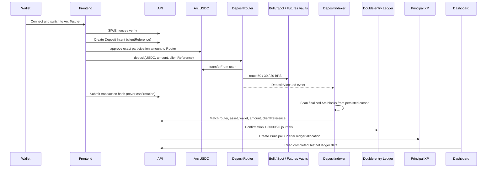

# Phase 2B deposit flow

Arc deterministic finality means the indexer does not wait for an Ethereum-style confirmation count. It still uses a persisted block cursor and a unique `(chainId, txHash, logIndex)` event key so a replay is safe. A frontend-supplied transaction hash only moves a deposit to `TX_SUBMITTED`; only the matched event can move it to `CHAIN_CONFIRMED` and then `COMPLETED`.
